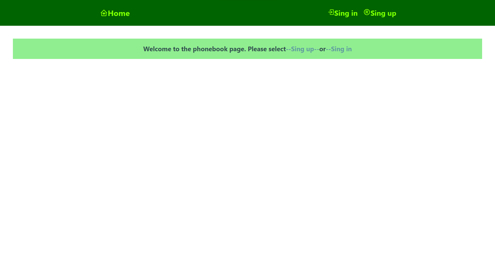
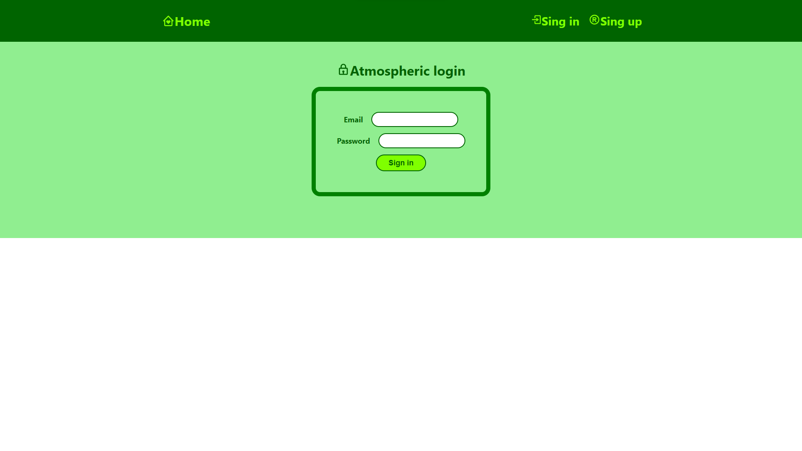
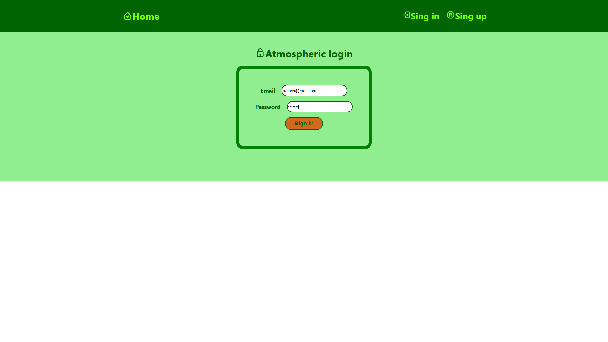
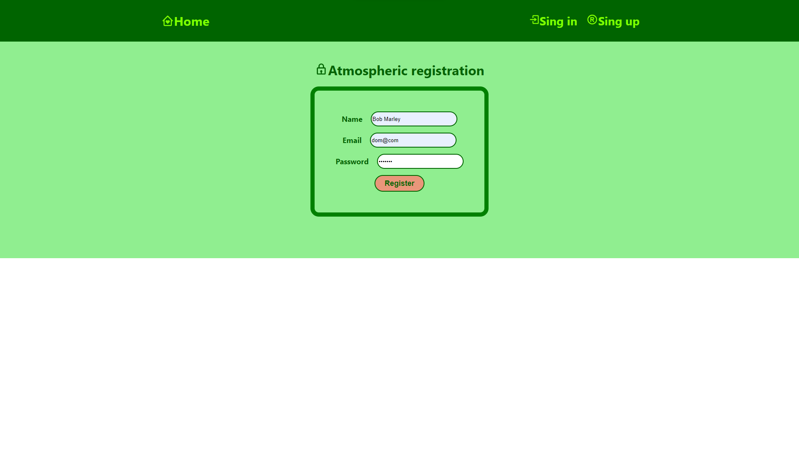

# My name is the React project "Phone Book"

The project enables user registration, login and updates, as well as work with a
private set of contacts. It allows you to add and remove contacts.

This app consolidates material from your online course. This project was created
using [Create React App](https://github.com/facebook/create-react-app)

Refactored the code of the "Phone Book" application by adding the management
state using the Redux Toolkit library.

This project is a continuation of task 7 "The telephone book", which used hooks
and Redux Technologies/Redux Toolkit.

## What was created in the application

- The store was created using configurationStore().
- An action was taken to save and delete the contact and refresh the filter.
- Contact and filter reducers were created. The createSlice() function was used.
- React components and Redux logic were combined using the React-Redux library
  hooks.
- The app saves contacts using the backend.
- The backend of the project was created using a ready-made back-end.
- The createAsyncThunk function was used to work with the backend asynchronous
  queries.

##Added routing with React Router library:

/register - public route for registering a new user with the form /login -
public login route for an existing user with the form /contacts - private route
for working with the user's contact list

 
 

## Technologies

- "JavaScript"
- "react": "^18.2.0",
- "nanoid": "^5.0.4",
- "node": "v18.16.1",
- "react-dom": "^18.1.0",
- "react-redux": "^9.0.2",
- "react-scripts": "5.0.1",
- "redux": "^5.0.0",
- "redux-persist": "^6.0.0",
- "prop-types": "^15.8.1",
- "components": "^0.1.0",
- "eslint-config-react-app":"^7.0.1",
- "@reduxjs/toolkit": "^2.0.1",
- "axios": "^1.6.2",

## Organize something

- git clone - clone the remote repository locally to your computer;
- npm install - create dependencies;
- npm start - run the application, access to it will be possible at:
  localhost:3000;
